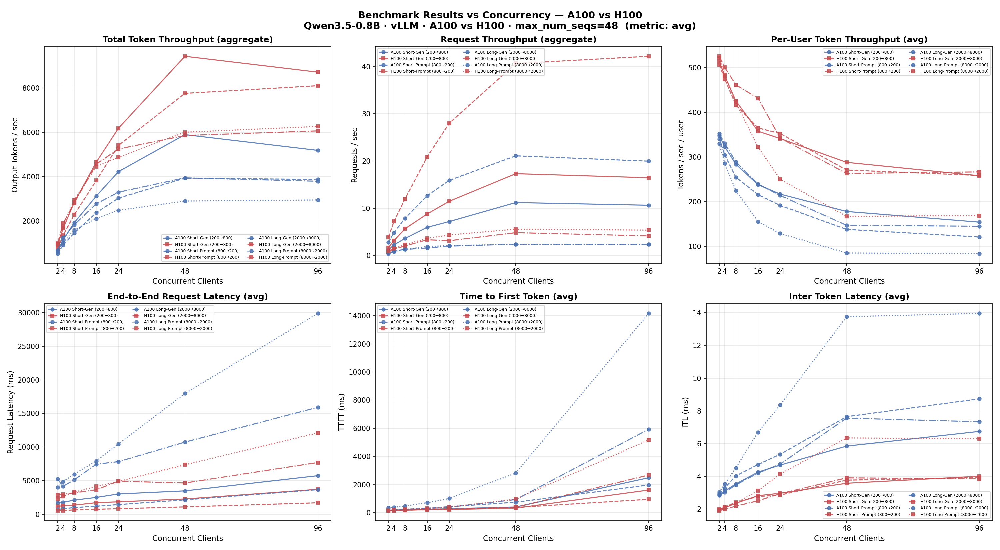
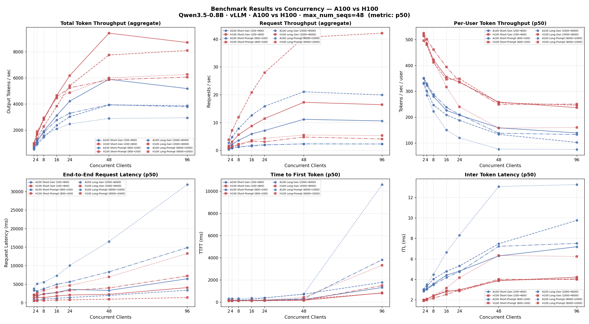
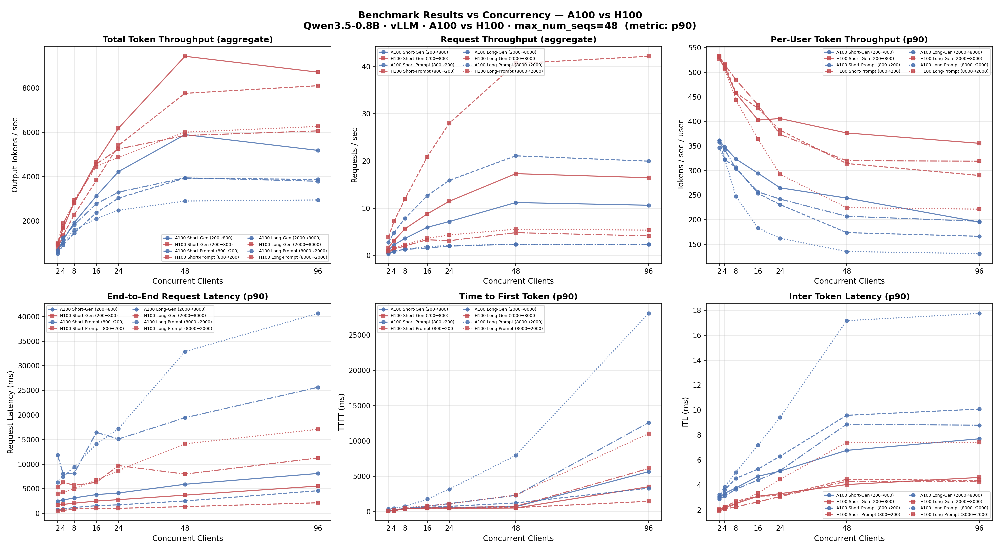
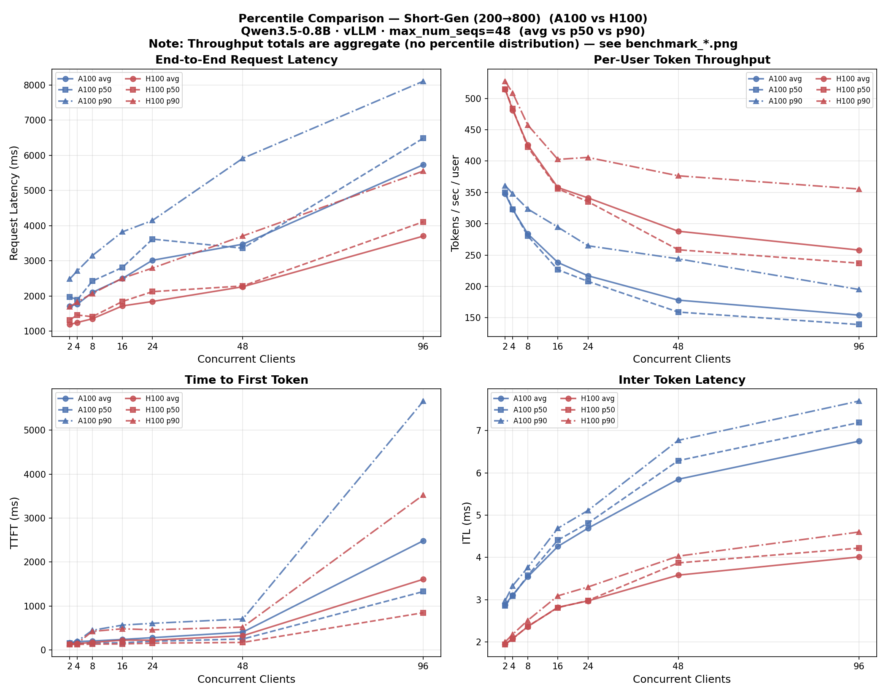
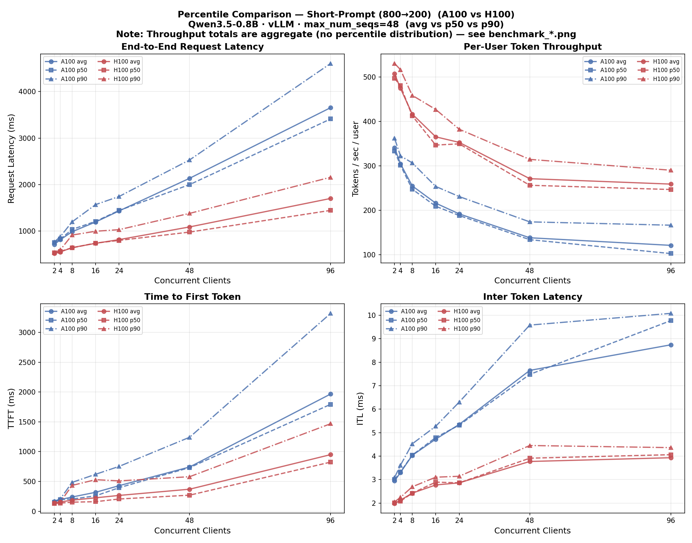
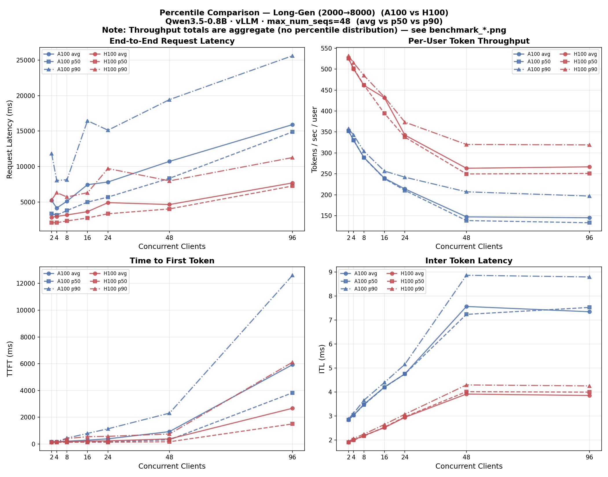
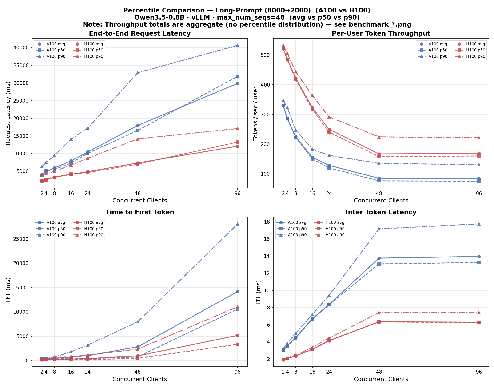

# Deployment Template E2E Demo

Deploy a HuggingFace model (Qwen3.5-0.8B) to an Azure ML managed online endpoint
using a **deployment template** — a reusable, versioned definition of environment,
probes, scoring port, and runtime configuration registered in an Azure ML registry.

> **Note:** Only the **CLI** path (`scripts/cli/`) is fully tested and documented.
> SDK and REST API paths are pending.

> **Note:** Logs are not included in this repository to ensure scrubbing of any credentials
> or sensitive information. Running the scripts will produce logs under `logs/cli/`.

> **Automated runner:** All steps below can be run via `./scripts/run-e2e-cli.sh`.
> Edit `configs/e2e-config.sh` to change versions, names, or Azure resources.
> See [Running the E2E CLI Pipeline](#running-the-e2e-cli-pipeline) for usage and GPU SKU options.

## Architecture

```
┌─────────────────────────────────────────────────────────┐
│  Azure ML Registry                                      │
│  ┌──────────────┐  ┌──────────────┐  ┌──────────────┐  │
│  │ Environment   │  │ Deployment   │  │ Model        │  │
│  │ vllm-qwen35  │◄─│ Template     │◄─│ Qwen35-08B   │  │
│  │ (Dockerfile) │  │ vllm-1gpu-   │  │ (DT link)    │  │
│  │              │  │ h100         │  │              │  │
│  └──────────────┘  └──────┬───────┘  └──────────────┘  │
└─────────────────────┬─────┘──────────────────────────────┘
                      │
┌─────────────────────▼───────────────────────────────────┐
│  Azure ML Workspace                                     │
│                                                         │
│  ┌──────────────┐  ┌──────────────┐                     │
│  │ Endpoint     │──│ Deployment   │                     │
│  │ qwen35-ep-   │  │ qwen35-vllm  │  (A100 GPU)         │
│  │ a100         │  │              │                     │
│  └──────────────┘  └──────────────┘                     │
│                                                         │
│  ┌──────────────┐  ┌──────────────┐                     │
│  │ Endpoint     │──│ Deployment   │                     │
│  │ qwen35-ep-   │  │ qwen35-vllm  │  (H100 GPU)         │
│  │ h100         │  │              │                     │
│  └──────────────┘  └──────────────┘                     │
└─────────────────────────────────────────────────────────┘
```

Each GPU SKU gets its own endpoint and deployment. This keeps endpoint-level
limits (rate limits, concurrent connections) independent across GPU types and
enables truly parallel benchmarking.

The deployment template supplies: environment, scoring port (8000), health probes
(`/health`), env vars (vLLM config), and instance type. The deployment only needs
to reference the model — the DT provides everything else.

## Prerequisites

- Azure CLI with `ml` extension (`az extension add -n ml`)
- An Azure ML workspace and registry
- `az login` completed

```bash
# Set your variables (or edit configs/e2e-config.sh and source scripts/env.sh)
SUBSCRIPTION_ID="75703df0-38f9-4e2e-8328-45f6fc810286"
RESOURCE_GROUP="mabables-rg"
AZUREML_WORKSPACE="mabables-feb2026"
AZUREML_REGISTRY="mabables-reg-feb26"

MODEL_NAME="Qwen35-08B"
MODEL_VERSION="50"
ENVIRONMENT_NAME="vllm-qwen35"
ENVIRONMENT_VERSION="50"
TEMPLATE_NAME="vllm-1gpu-h100"
TEMPLATE_VERSION="50"
ENDPOINT_NAME="qwen35-endpoint"
DEPLOYMENT_NAME="qwen35-vllm"

az account set --subscription "$SUBSCRIPTION_ID"
```

---

## Step 1: Create the environment

The environment wraps vLLM in a Docker image with runit process supervision,
required by Azure ML managed endpoints.

Key design decisions:
- **Base image:** `vllm/vllm-openai:latest` — provides vLLM + CUDA + PyTorch
- **Strict offline:** `HF_HUB_OFFLINE=1` — no model downloads at runtime
- **`ENTRYPOINT []`:** Clears base image entrypoint so runit runs as PID 1

### Why two steps: workspace create → registry share

Azure ML **registries do not have compute** — they are pure metadata + storage catalogs.
Building a Docker image from a Dockerfile requires a compute backend (ACR Tasks in the
workspace's ACR). Therefore, environments with Dockerfile builds must be:

1. **Created in the workspace** — this uploads the build context and triggers an async
   Docker image build in the workspace's ACR (~17 min for the vLLM base image)
2. **Shared (promoted) to the registry** — once the image is built, `az ml environment share`
   copies the built image from the workspace ACR to the registry's ACR and registers the
   environment metadata in the registry

```
Workspace                                    Registry
┌────────────────────────┐                   ┌────────────────────────┐
│ az ml environment      │                   │                        │
│   create               │                   │  No compute — cannot   │
│         │              │                   │  build Docker images   │
│         ▼              │                   │                        │
│ ┌──────────────────┐   │   az ml env       │ ┌──────────────────┐   │
│ │ ACR: build image │   │──── share ───────▶│ │ ACR: copy image  │   │
│ │ (~17 min)        │   │                   │ │                  │   │
│ └──────────────────┘   │                   │ └──────────────────┘   │
│                        │                   │                        │
│ Build context stored   │                   │ Build context copied   │
│ in workspace blob      │                   │ to registry blob       │
│ (accessible to user)   │                   │ (DenyAssignment —      │
│                        │                   │  see bugs/)            │
└────────────────────────┘                   └────────────────────────┘
```

> **Note:** The Docker image build is async. The CLI/SDK/ARM API do not expose build
> status — our script polls an internal Studio API for `imageExistsInRegistry`.
> See [bugs/env-image-api-not-exposed.md](../bugs/env-image-api-not-exposed.md).

**Alternative: pre-built image → register directly in registry.** If you build the container
image locally (or in your own CI pipeline) and push it to an accessible ACR, you can skip the
workspace create + share flow entirely. Use `image:` instead of `build:` in `environment.yml`:

```yaml
$schema: https://azuremlschemas.azureedge.net/latest/environment.schema.json
name: vllm-qwen35
version: 50
image: myacr.azurecr.io/vllm-qwen35:v50
```

```bash
az ml environment create \
  --file environment.yml \
  --registry-name "$AZUREML_REGISTRY"
```

Since no Docker build is needed, the environment is registered directly in the registry in
seconds. This is useful when:
- You have a CI/CD pipeline that builds and scans images before publishing
- The base image is large and you want faster, more predictable builds
- You need to pin to an exact image digest for reproducibility

### Dockerfile

```dockerfile
FROM vllm/vllm-openai:latest

# Install runit (provides runsvdir) required by Azure ML managed endpoints
RUN apt-get update && apt-get install -y --no-install-recommends runit && \
    rm -rf /var/lib/apt/lists/*

# Create runit service directory for vLLM
RUN mkdir -p /var/runit/vllm

# vLLM runit service: starts the OpenAI-compatible API server on port 8000
# See vllm-run.sh for details — strictly offline, no HF Hub downloads.
COPY vllm-run.sh /var/runit/vllm/run
RUN chmod +x /var/runit/vllm/run

# Reset base image entrypoint so CMD runs as the main process
ENTRYPOINT []
CMD ["runsvdir", "/var/runit"]
```

### CLI commands

**Step 1a** — Create in workspace (triggers async Docker image build):

```bash
az ml environment create \
  --file scripts/cli/yaml/environment.yml \
  -w "$AZUREML_WORKSPACE" -g "$RESOURCE_GROUP"
```

**Step 1b** — Wait for the image build to complete (~17 min), then share to registry:

```bash
az ml environment share \
  --name "$ENVIRONMENT_NAME" --version "$ENVIRONMENT_VERSION" \
  --share-with-name "$ENVIRONMENT_NAME" --share-with-version "$ENVIRONMENT_VERSION" \
  --registry-name "$AZUREML_REGISTRY" \
  -w "$AZUREML_WORKSPACE" -g "$RESOURCE_GROUP"
```

<details>
<summary>Example output (Step 1 — first run, full build + share)</summary>

```
[START] 2026-04-16 22:03:23 — Step 1: Create environment
[INFO]  Creating environment 'vllm-qwen35' v50 in workspace 'mabables-feb2026'...
```

**Step 1a** — `az ml environment create` returns the workspace environment immediately
(Docker build starts asynchronously in the background):

```json
{
  "build": {
    "dockerfile_path": "Dockerfile",
    "path": "https://mabablesfeb2028493783618.blob.core.windows.net/azureml-blobstore-c4742136-9908-446e-b3b9-043f0033e4dc/LocalUpload/a3d7d29829871dfea3553ae69c1738795d87c2bf639bf84c4fd0e42065344e45/yaml/"
  },
  "creation_context": {
    "created_at": "2026-04-17T05:03:40.273527+00:00",
    "created_by": "Manoj Bableshwar",
    "created_by_type": "User",
    "last_modified_at": "2026-04-17T05:03:40.273527+00:00",
    "last_modified_by": "Manoj Bableshwar",
    "last_modified_by_type": "User"
  },
  "description": "vLLM OpenAI-compatible inference server with runit for Azure ML managed endpoints",
  "id": "azureml:/subscriptions/75703df0-38f9-4e2e-8328-45f6fc810286/resourceGroups/mabables-rg/providers/Microsoft.MachineLearningServices/workspaces/mabables-feb2026/environments/vllm-qwen35/versions/50",
  "name": "vllm-qwen35",
  "os_type": "linux",
  "resourceGroup": "mabables-rg",
  "tags": {
    "framework": "vllm",
    "model_family": "qwen3.5"
  },
  "version": "50"
}
```

**Wait** — poll the internal Studio image API until `imageExistsInRegistry: true`:

```
[INFO]  Environment create command completed.
[INFO]  Waiting for environment image build to complete (polling every 30s, up to 1 hour)...
[INFO]  Image not ready yet (0s elapsed) -- waiting 30s...
[INFO]  Image not ready yet (30s elapsed) -- waiting 30s...
        ... (polling continues ~21 minutes) ...
[INFO]  Image not ready yet (1230s elapsed) -- waiting 30s...
[INFO]  Environment image build completed (1260s elapsed).
```

**Step 1b** — `az ml environment share` copies the built image to the registry ACR:

```
[INFO]  Promoting environment 'vllm-qwen35' v50 from workspace to registry...
```
```json
{
  "build": {
    "dockerfile_path": "Dockerfile",
    "path": "https://6ec5159fc0c.blob.core.windows.net/mabables-r-b9e12eea-9763-5fd2-b7fc-9fd564b1e8f2/LocalUpload/a3d7d29829871dfea3553ae69c1738795d87c2bf639bf84c4fd0e42065344e45/yaml"
  },
  "creation_context": {
    "created_at": "2026-04-17T05:26:03.102570+00:00",
    "created_by": "Manoj Bableshwar",
    "created_by_type": "User",
    "last_modified_at": "2026-04-17T05:26:03.102570+00:00",
    "last_modified_by": "Manoj Bableshwar",
    "last_modified_by_type": "User"
  },
  "description": "vLLM OpenAI-compatible inference server with runit for Azure ML managed endpoints",
  "id": "azureml://registries/mabables-reg-feb26/environments/vllm-qwen35/versions/50",
  "name": "vllm-qwen35",
  "os_type": "linux",
  "tags": {
    "framework": "vllm",
    "model_family": "qwen3.5"
  },
  "version": "50"
}
```
```
[INFO]  Environment share command completed -- verifying it landed in registry...
[INFO]  Confirmed: environment exists in registry.
[DONE]  2026-04-16 22:27:12 — elapsed 23m 49s
```

</details>

<details>
<summary>Example output (Step 1 — subsequent run, environment already exists)</summary>

```
[START] 2026-04-17 09:55:10 — Step 1: Create environment
[INFO]  Environment 'vllm-qwen35' v50 already exists in workspace -- proceeding.
[INFO]  Environment 'vllm-qwen35' v50 already exists in registry -- skipping promotion.
[INFO]  Showing registry environment:
```
```json
{
  "build": {
    "dockerfile_path": "Dockerfile",
    "path": "https://6ec5159fc0c.blob.core.windows.net/mabables-r-b9e12eea-9763-5fd2-b7fc-9fd564b1e8f2/LocalUpload/a3d7d29829871dfea3553ae69c1738795d87c2bf639bf84c4fd0e42065344e45/yaml"
  },
  "creation_context": {
    "created_at": "2026-04-17T05:26:03.102570+00:00",
    "created_by": "Manoj Bableshwar",
    "created_by_type": "User",
    "last_modified_at": "2026-04-17T05:26:03.102570+00:00",
    "last_modified_by": "Manoj Bableshwar",
    "last_modified_by_type": "User"
  },
  "description": "vLLM OpenAI-compatible inference server with runit for Azure ML managed endpoints",
  "id": "azureml://registries/mabables-reg-feb26/environments/vllm-qwen35/versions/50",
  "name": "vllm-qwen35",
  "os_type": "linux",
  "tags": {
    "framework": "vllm",
    "model_family": "qwen3.5"
  },
  "version": "50"
}
```
```
[DONE]  2026-04-17 09:55:21 — elapsed 0m 11s
```

</details>

### Built image in ACR

After the environment is shared to the registry, the built Docker image lives in the
registry's ACR. The ARM API and CLI **do not expose** the built image URI or ACR address
(see [bugs/env-image-api-not-exposed.md](../bugs/env-image-api-not-exposed.md)).

To fetch the ACR image URI programmatically, call the Studio internal `consume/imageDetails`
API. This endpoint is **registry-scoped** — it takes the registry asset ID directly, no
workspace context required:

```bash
REGION="eastus2"
ENV_ASSET_ID="azureml://registries/mabables-reg-feb26/environments/vllm-qwen35/versions/50"
TOKEN=$(az account get-access-token --query accessToken -o tsv)

# Studio internal data-plane API (not ARM). Same AAD token, no extra permissions.
curl -s -X POST \
  -H "Authorization: Bearer $TOKEN" \
  -H "Content-Type: application/json" \
  -d "{\"assetId\":\"${ENV_ASSET_ID}\"}" \
  "https://ml.azure.com/api/${REGION}/environment/v1.0/consume/imageDetails"
```

| Field | Value |
|-------|-------|
| ACR address | `3b25b39762c.azurecr.io` |
| Docker image | `3b25b39762c.azurecr.io/mabables-reg-feb26/.../vllm-qwen35/azureml/azureml_d892741a6e44601ebbb1f43441a6b0b9` |

> **Warning:** This API is undocumented and may change without notice. It is the same
> API the Azure ML Studio UI uses under the hood. See
> [bugs/env-image-api-not-exposed.md](../bugs/env-image-api-not-exposed.md) for
> the feature request to add these fields to the public ARM API.

<details>
<summary>Full imageDetails response</summary>

```json
{
  "imageExistsInRegistry": true,
  "intellectualPropertyPublisher": null,
  "imageCapabilities": {
    "canAccessData": true,
    "hasCrossTenantSupport": false
  },
  "ingredients": null,
  "vulnerabilityFindings": {
    "details": null
  },
  "pythonEnvironment": {
    "interpreterPath": "python",
    "condaEnvironmentName": null,
    "condaEnvironmentPath": null
  },
  "dockerImage": {
    "name": "3b25b39762c.azurecr.io/mabables-reg-feb26/2fae9e00-8f31-5032-b2ff-0f52e11fb645/vllm-qwen35/azureml/azureml_d892741a6e44601ebbb1f43441a6b0b9",
    "registry": {
      "address": "3b25b39762c.azurecr.io",
      "username": null,
      "password": null
    }
  },
  "warnings": []
}
```

</details>

## Step 2: Create the deployment template

The deployment template defines everything the endpoint needs to serve the model.

### Environment variables

| Variable | Value | Purpose |
|----------|-------|---------|
| `HF_HOME` | `/tmp/hf_cache` | Redirects HuggingFace cache to a writable temp directory (container filesystem is read-only for default paths) |
| `HF_HUB_OFFLINE` | `1` | Prevents HuggingFace Hub downloads at runtime — all artifacts must be pre-mounted |
| `TRANSFORMERS_OFFLINE` | `1` | Same as above for the `transformers` library; ensures no network calls to HF |
| `VLLM_GPU_MEMORY_UTILIZATION` | `0.9` | Fraction of GPU memory vLLM is allowed to use for KV cache; 0.9 leaves 10% headroom for CUDA overhead |
| `VLLM_MAX_MODEL_LEN` | `131072` | Maximum sequence length (input + output tokens) the engine will accept; set to the model's full context window (128K) |
| `VLLM_MAX_NUM_SEQS` | `48` | Maximum number of sequences batched concurrently; controls throughput vs. memory trade-off |
| `VLLM_NO_USAGE_STATS` | `1` | Disables anonymous telemetry reporting from vLLM |
| `VLLM_TENSOR_PARALLEL_SIZE` | `1` | Number of GPUs for tensor parallelism; `1` = single GPU (this DT is for single-GPU SKUs) |

> **Note:** `VLLM_SERVED_MODEL_NAME` is intentionally **not** set in the deployment template to keep it model-agnostic.
> The entrypoint script (`vllm-run.sh`) defaults it to `model`, so all clients use `"model": "model"` in API requests
> regardless of which model is deployed. One Azure ML endpoint serves exactly one model, so a generic name avoids
> coupling the DT to a specific model.

### Deployment template fields

| Field | Value | Purpose |
|-------|-------|---------|
| `name` | `vllm-1gpu-h100` | Unique identifier for this DT in the registry |
| `version` | `50` | Incremented on each update; models reference a specific version |
| `stage` | `Development` | Lifecycle stage — `Development`, `Preview`, or `Production` |
| `deploymentTemplateType` | `managed` | Azure ML manages the compute lifecycle (vs. `kubernetes`) |
| `environmentId` | `azureml://registries/.../vllm-qwen35/versions/50` | The container image + conda/pip environment used to run vLLM |
| `allowedInstanceTypes` | `Standard_NC24ads_A100_v4`, `Standard_NC40ads_H100_v5` | GPU SKUs this DT is validated for; deployment creation rejects SKUs not in this list |
| `defaultInstanceType` | `Standard_NC40ads_H100_v5` | SKU used when the deployment doesn't specify one |
| `instanceCount` | `1` | Default number of instances behind the endpoint |
| `modelMountPath` | `/opt/ml/model` | Path where Azure ML mounts the registered model's artifacts inside the container |
| `scoringPort` | `8000` | Port vLLM listens on inside the container |
| `scoringPath` | `/v1` | URL prefix appended to the endpoint URL; exposes the OpenAI-compatible API root |
| `livenessProbe` | `GET /health:8000`, initial delay 10 min, period 10s | Azure ML restarts the container if this probe fails; 10 min initial delay accounts for model load time |
| `readinessProbe` | `GET /health:8000`, initial delay 10 min, period 10s | Azure ML routes traffic only after this probe succeeds |
| `requestSettings.maxConcurrentRequestsPerInstance` | `10` | Max in-flight requests the Azure ML front-end routes to one instance (vLLM's internal `max_num_seqs` independently controls batching) |
| `requestSettings.requestTimeout` | `PT1M30S` | Azure ML front-end drops the request if vLLM doesn't respond within 90 seconds |
| `description` | Free-text | Human-readable note shown in the registry UI |

```bash
az ml deployment-template create \
  --file scripts/cli/yaml/deployment-template.yml \
  --registry-name "$AZUREML_REGISTRY"
```

<details>
<summary>Example output (Step 2)</summary>

```
[START] 2026-04-15 20:48:18 — Step 2: Create deployment template
```
```json
{
  "allowedInstanceTypes": [
    "Standard_NC40ads_H100_v5"
  ],
  "defaultInstanceType": "Standard_NC40ads_H100_v5",
  "deploymentTemplateType": "managed",
  "description": "Generic vLLM deployment template for single-GPU models (v50)",
  "environmentId": "azureml://registries/mabables-reg-feb26/environments/vllm-qwen35/versions/50",
  "environmentVariables": {
    "HF_HOME": "/tmp/hf_cache",
    "HF_HUB_OFFLINE": "1",
    "TRANSFORMERS_OFFLINE": "1",
    "VLLM_GPU_MEMORY_UTILIZATION": "0.9",
    "VLLM_MAX_MODEL_LEN": "131072",
    "VLLM_MAX_NUM_SEQS": "48",
    "VLLM_NO_USAGE_STATS": "1",
    "VLLM_TENSOR_PARALLEL_SIZE": "1"
  },
  "instanceCount": 1,
  "livenessProbe": {
    "httpMethod": "GET",
    "initialDelay": "PT10M",
    "path": "/health",
    "period": "PT10S",
    "port": 8000,
    "scheme": "http",
    "successThreshold": 1,
    "timeout": "PT10S"
  },
  "modelMountPath": "/opt/ml/model",
  "name": "vllm-1gpu-h100",
  "readinessProbe": {
    "httpMethod": "GET",
    "initialDelay": "PT10M",
    "path": "/health",
    "period": "PT10S",
    "port": 8000,
    "scheme": "http",
    "successThreshold": 1,
    "timeout": "PT10S"
  },
  "requestSettings": {
    "maxConcurrentRequestsPerInstance": 10,
    "requestTimeout": "PT1M30S"
  },
  "scoringPath": "/v1",
  "scoringPort": 8000,
  "stage": "Development",
  "version": "50"
}
```
```
[DONE]  2026-04-15 20:48:25 — elapsed 0m 7s
```

</details>

## Step 3: Register the model

The model includes two important fields:
- **`properties.aotManifest: "True"`** — required for the service to recognize model artifacts
- **`default_deployment_template`** — links model → DT so deployments auto-inherit settings

> **Note:** We use `azcopy` + REST API instead of `az ml model create` because the
> CLI's built-in upload uses single-threaded Python blob uploads which fail with
> BrokenPipeError on large model files (>1 GB). See `3-register-model.sh` for details.

```bash
# The automated script handles azcopy upload + REST registration + DT PATCH.
# For reference, the equivalent CLI command (not used due to large file sizes):
#
#   az ml model create \
#     --file scripts/cli/yaml/model.yml \
#     --registry-name "$AZUREML_REGISTRY"
```

Confirm the DT link:

```bash
az ml model show \
  --name "$MODEL_NAME" --version "$MODEL_VERSION" \
  --registry-name "$AZUREML_REGISTRY" \
  --query "default_deployment_template.asset_id" -o tsv
# Expected: azureml://registries/.../deploymentTemplates/vllm-1gpu-h100/versions/50
```

<details>
<summary>Example output (Step 3)</summary>

```
[START] 2026-04-15 20:48:25 — Step 3: Register model
[INFO]  Uploading model artifacts via azcopy (~1.77 GB)…
```
azcopy upload summary:
```
Elapsed Time (Minutes): 3.6341
Number of File Transfers: 27
Number of File Transfers Completed: 27
Number of File Transfers Failed: 0
Total Number of Bytes Transferred: 1769981816
Final Job Status: Completed
```
```
[INFO]  azcopy upload completed in 219s
[INFO]  Creating model asset 'Qwen35-08B' v50 in registry via REST…
[INFO]  Model asset created (provisioningState: Creating)
[INFO]  Associating deployment template with model via PATCH…
[INFO]  Deployment template patched on model.
```
Model artifacts in blob storage (`azcopy list`):
```
.gitattributes                                    Content Length: 1,570
LICENSE                                           Content Length: 11,544
README.md                                         Content Length: 61,705
chat_template.jinja                               Content Length: 7,755
config.json                                       Content Length: 2,907
merges.txt                                        Content Length: 3,353,259
model.safetensors-00001-of-00001.safetensors      Content Length: 1,746,942,600
model.safetensors.index.json                      Content Length: 50,900
preprocessor_config.json                          Content Length: 390
tokenizer.json                                    Content Length: 12,807,982
tokenizer_config.json                             Content Length: 16,709
video_preprocessor_config.json                    Content Length: 385
vocab.json                                        Content Length: 6,722,759
```
Model verification (`az ml model show`):
```json
{
  "creation_context": {
    "created_at": "2026-04-16T03:52:11.670750+00:00",
    "created_by": "Manoj Bableshwar",
    "created_by_type": "User",
    "last_modified_at": "2026-04-16T03:52:13.099944+00:00",
    "last_modified_by": "Manoj Bableshwar",
    "last_modified_by_type": "User"
  },
  "default_deployment_template": {
    "asset_id": "azureml://registries/mabables-reg-feb26/deploymentTemplates/vllm-1gpu-h100/versions/50"
  },
  "description": "Qwen3.5-0.8B with deployment template v50 — azcopy upload",
  "id": "azureml://registries/mabables-reg-feb26/models/Qwen35-08B/versions/50",
  "name": "Qwen35-08B",
  "path": "https://6ec5159fc0c.blob.core.windows.net/mabables-r-581880be-e2ff-59b1-b6bb-cc6e7fade028",
  "properties": {
    "modelManifestPathOrUri": "/mabables-r-b7988b5b-bcb8-537f-9539-6326dcfe0f10/manifest.base.json"
  },
  "tags": {
    "architecture": "qwen3_5",
    "framework": "transformers",
    "hf_model_id": "Qwen/Qwen3.5-0.8B",
    "parameters": "0.8B",
    "source": "huggingface"
  },
  "type": "custom_model",
  "version": "50"
}
```
```
[DONE]  2026-04-15 20:52:16 — elapsed 3m 51s
```

</details>

## Step 4: Create the endpoints

The e2e runner creates a separate endpoint per GPU SKU (in parallel):

| SKU | Endpoint | YAML |
|-----|----------|------|
| `Standard_NC24ads_A100_v4` | `qwen35-ep-a100` | `endpoint-a100.yml` |
| `Standard_NC40ads_H100_v5` | `qwen35-ep-h100` | `endpoint-h100.yml` |

```bash
# Manual (one endpoint):
az ml online-endpoint create \
  --file scripts/cli/yaml/endpoint-a100.yml \
  -w "$AZUREML_WORKSPACE" -g "$RESOURCE_GROUP"
```

The automated runner creates only the endpoints for requested SKUs (`E2E_SKUS`).

<details>
<summary>Example output (Step 4)</summary>

```
[START] 2026-04-17 09:55:38 — Step 4: Create online endpoints (a100 h100)
[INFO]  Creating endpoints in parallel for: a100 h100
[INFO]  [qwen35-ep-a100] Creating...
[INFO]  [qwen35-ep-h100] Creating...
```

A100 endpoint:
```json
{
  "auth_mode": "key",
  "description": "Online endpoint for Qwen3.5-0.8B on A100",
  "id": "/subscriptions/75703df0-38f9-4e2e-8328-45f6fc810286/resourceGroups/mabables-rg/providers/Microsoft.MachineLearningServices/workspaces/mabables-feb2026/onlineEndpoints/qwen35-ep-a100",
  "identity": {
    "principal_id": "7862abec-a34c-4486-b51e-db1bb146ef75",
    "tenant_id": "7f292395-a08f-4cc0-b3d0-a400b023b0d2",
    "type": "system_assigned"
  },
  "kind": "Managed",
  "location": "eastus2",
  "mirror_traffic": {},
  "name": "qwen35-ep-a100",
  "openapi_uri": "https://qwen35-ep-a100.eastus2.inference.ml.azure.com/swagger.json",
  "properties": {
    "AzureAsyncOperationUri": "https://management.azure.com/subscriptions/75703df0-38f9-4e2e-8328-45f6fc810286/providers/Microsoft.MachineLearningServices/locations/eastus2/mfeOperationsStatus/oeidp:c4742136-9908-446e-b3b9-043f0033e4dc:8ec59228-7cc2-4ea0-bbfa-bf8c4c63aa82?api-version=2022-02-01-preview",
    "azureml.onlineendpointid": "/subscriptions/75703df0-38f9-4e2e-8328-45f6fc810286/resourcegroups/mabables-rg/providers/microsoft.machinelearningservices/workspaces/mabables-feb2026/onlineendpoints/qwen35-ep-a100",
    "createdAt": "2026-04-17T16:55:44.738923+0000",
    "createdBy": "Manoj Bableshwar",
    "lastModifiedAt": "2026-04-17T16:55:44.738923+0000"
  },
  "provisioning_state": "Succeeded",
  "public_network_access": "enabled",
  "resourceGroup": "mabables-rg",
  "scoring_uri": "https://qwen35-ep-a100.eastus2.inference.ml.azure.com/score",
  "tags": {},
  "traffic": {}
}
```

H100 endpoint:
```json
{
  "auth_mode": "key",
  "description": "Online endpoint for Qwen3.5-0.8B on H100",
  "id": "/subscriptions/75703df0-38f9-4e2e-8328-45f6fc810286/resourceGroups/mabables-rg/providers/Microsoft.MachineLearningServices/workspaces/mabables-feb2026/onlineEndpoints/qwen35-ep-h100",
  "identity": {
    "principal_id": "ffda82ca-1368-49b6-89af-b890caa885ec",
    "tenant_id": "7f292395-a08f-4cc0-b3d0-a400b023b0d2",
    "type": "system_assigned"
  },
  "kind": "Managed",
  "location": "eastus2",
  "mirror_traffic": {},
  "name": "qwen35-ep-h100",
  "openapi_uri": "https://qwen35-ep-h100.eastus2.inference.ml.azure.com/swagger.json",
  "properties": {
    "AzureAsyncOperationUri": "https://management.azure.com/subscriptions/75703df0-38f9-4e2e-8328-45f6fc810286/providers/Microsoft.MachineLearningServices/locations/eastus2/mfeOperationsStatus/oeidp:c4742136-9908-446e-b3b9-043f0033e4dc:490977e3-7a71-4fc0-94b1-c2c7970c69f9?api-version=2022-02-01-preview",
    "azureml.onlineendpointid": "/subscriptions/75703df0-38f9-4e2e-8328-45f6fc810286/resourcegroups/mabables-rg/providers/microsoft.machinelearningservices/workspaces/mabables-feb2026/onlineendpoints/qwen35-ep-h100",
    "createdAt": "2026-04-17T16:55:44.836272+0000",
    "createdBy": "Manoj Bableshwar",
    "lastModifiedAt": "2026-04-17T16:55:44.836272+0000"
  },
  "provisioning_state": "Succeeded",
  "public_network_access": "enabled",
  "resourceGroup": "mabables-rg",
  "scoring_uri": "https://qwen35-ep-h100.eastus2.inference.ml.azure.com/score",
  "tags": {},
  "traffic": {}
}
```
```
[INFO]  [qwen35-ep-h100] Created.
[INFO]  [qwen35-ep-a100] Created.
[DONE]  2026-04-17 09:56:53 — elapsed 1m 15s
```

</details>

## Step 5: Create the deployments

Each deployment YAML is minimal — it only specifies the model reference and instance
type. The deployment template (linked via the model) provides everything else:

```yaml
# deployment-a100.yml
name: qwen35-vllm
endpoint_name: qwen35-ep-a100
model: azureml://registries/mabables-reg-feb26/models/Qwen35-08B/versions/50
instance_type: Standard_NC24ads_A100_v4
instance_count: 1
```

```yaml
# deployment-h100.yml
name: qwen35-vllm
endpoint_name: qwen35-ep-h100
model: azureml://registries/mabables-reg-feb26/models/Qwen35-08B/versions/50
instance_type: Standard_NC40ads_H100_v5
instance_count: 1
```

> **Important:** Environment variables set in the deployment YAML are ignored when a
> deployment template is attached. Configure all env vars in the DT instead.

```bash
# Manual (one deployment):
az ml online-deployment create \
  --file scripts/cli/yaml/deployment-a100.yml \
  -w "$AZUREML_WORKSPACE" -g "$RESOURCE_GROUP" \
  --all-traffic
```

The automated runner deploys all requested SKUs in parallel. The CLI will detect
the DT linkage and print:

```
Model 'Qwen35-08B' has a default deployment template configured.
Default deployment template: azureml://registries/.../deploymentTemplates/vllm-1gpu-h100/versions/50
```

Provisioning typically takes 15-30 minutes per GPU (allocation + image pull + vLLM startup).
Both deployments provision simultaneously.

<details>
<summary>Example output (Step 5)</summary>

```
[START] 2026-04-17 09:56:53 — Step 5: Create online deployments (a100 h100)
[INFO]  Deploying in parallel for: a100 h100
[INFO]  [a100] Creating deployment...
[INFO]  [h100] Creating deployment...

Model 'Qwen35-08B' (version 50) from registry 'mabables-reg-feb26' has a default deployment template configured.
The deployment will use the default deployment template settings, and some deployment parameters may be ignored.
Default deployment template: azureml://registries/mabables-reg-feb26/deploymentTemplates/vllm-1gpu-h100/versions/50
..................................................................................................................................................................................................................................
```

A100 deployment (`Standard_NC24ads_A100_v4`):
```json
{
  "app_insights_enabled": false,
  "creation_context": {
    "created_at": "2026-04-17T16:57:03.835400+00:00",
    "created_by": "Manoj Bableshwar",
    "last_modified_at": "2026-04-17T16:57:03.835401+00:00"
  },
  "egress_public_network_access": "enabled",
  "endpoint_name": "qwen35-ep-a100",
  "environment_variables": {},
  "id": "/subscriptions/75703df0-38f9-4e2e-8328-45f6fc810286/resourceGroups/mabables-rg/providers/Microsoft.MachineLearningServices/workspaces/mabables-feb2026/onlineEndpoints/qwen35-ep-a100/deployments/qwen35-vllm",
  "instance_count": 1,
  "instance_type": "Standard_NC24ads_A100_v4",
  "model": "azureml://registries/mabables-reg-feb26/models/Qwen35-08B/versions/50",
  "name": "qwen35-vllm",
  "properties": {
    "AzureAsyncOperationUri": "https://management.azure.com/subscriptions/75703df0-38f9-4e2e-8328-45f6fc810286/providers/Microsoft.MachineLearningServices/locations/eastus2/mfeOperationsStatus/odidp:c4742136-9908-446e-b3b9-043f0033e4dc:a5bea6d3-3217-44bd-87a0-c34f9ce41dc5?api-version=2023-04-01-preview"
  },
  "provisioning_state": "Succeeded",
  "request_settings": {
    "max_concurrent_requests_per_instance": 0
  },
  "resourceGroup": "mabables-rg",
  "scale_settings": {
    "type": "default"
  },
  "tags": {},
  "type": "managed"
}
```

H100 deployment (`Standard_NC40ads_H100_v5`):
```json
{
  "app_insights_enabled": false,
  "creation_context": {
    "created_at": "2026-04-17T16:57:03.833067+00:00",
    "created_by": "Manoj Bableshwar",
    "last_modified_at": "2026-04-17T16:57:03.833068+00:00"
  },
  "egress_public_network_access": "enabled",
  "endpoint_name": "qwen35-ep-h100",
  "environment_variables": {},
  "id": "/subscriptions/75703df0-38f9-4e2e-8328-45f6fc810286/resourceGroups/mabables-rg/providers/Microsoft.MachineLearningServices/workspaces/mabables-feb2026/onlineEndpoints/qwen35-ep-h100/deployments/qwen35-vllm",
  "instance_count": 1,
  "instance_type": "Standard_NC40ads_H100_v5",
  "model": "azureml://registries/mabables-reg-feb26/models/Qwen35-08B/versions/50",
  "name": "qwen35-vllm",
  "properties": {
    "AzureAsyncOperationUri": "https://management.azure.com/subscriptions/75703df0-38f9-4e2e-8328-45f6fc810286/providers/Microsoft.MachineLearningServices/locations/eastus2/mfeOperationsStatus/odidp:c4742136-9908-446e-b3b9-043f0033e4dc:e11c61b2-fbe4-4e6f-a4f4-2d49c2247f8e?api-version=2023-04-01-preview"
  },
  "provisioning_state": "Succeeded",
  "request_settings": {
    "max_concurrent_requests_per_instance": 0
  },
  "resourceGroup": "mabables-rg",
  "scale_settings": {
    "type": "default"
  },
  "tags": {},
  "type": "managed"
}
```
```
[INFO]  [h100] Created.
[INFO]  [a100] Created.
[DONE]  2026-04-17 10:19:34 — elapsed 22m 41s
```

</details>

## Step 6: Test inference

The automated runner tests each endpoint sequentially. For manual testing:

```bash
# Pick the endpoint to test
EP_NAME="qwen35-ep-a100"  # or qwen35-ep-h100

SCORING_URI=$(az ml online-endpoint show \
  --name "$EP_NAME" \
  -w "$AZUREML_WORKSPACE" -g "$RESOURCE_GROUP" \
  --query scoring_uri -o tsv)
BASE_URL="${SCORING_URI%/score}"

KEY=$(az ml online-endpoint get-credentials \
  --name "$EP_NAME" \
  -w "$AZUREML_WORKSPACE" -g "$RESOURCE_GROUP" \
  --query primaryKey -o tsv)

curl -s "$BASE_URL/v1/chat/completions" \
  -H "Authorization: Bearer $KEY" \
  -H "Content-Type: application/json" \
  -d '{
    "model": "model",
    "messages": [{"role": "user", "content": "Give me a short introduction to large language models."}],
    "max_tokens": 512
  }' | python3 -m json.tool
```

---

## CLI Reference (`az ml deployment-template`)

| Command | Description |
|---------|-------------|
| `create` | Create a new deployment template from a YAML file |
| `show` | Get a specific template by name and version |
| `list` | List all templates in a registry |
| `update` | Update metadata (description, tags) of an existing template |
| `archive` | Mark a template as inactive (hidden from list by default) |
| `restore` | Restore a previously archived template |

- **Registry-scoped only** — all commands require `--registry-name`
- **YAML-driven creation** — `create` accepts a `--file` parameter
- **Metadata updates** — `update` only modifies `description` and `tags`; for structural changes, create a new version

## SDK Reference (`azure-ai-ml`)

```python
from azure.ai.ml import MLClient, load_deployment_template
from azure.identity import DefaultAzureCredential

ml_client = MLClient(
    credential=DefaultAzureCredential(),
    registry_name="mabables-reg-feb26",
)

# Create
template = load_deployment_template(source="deployment-template.yml")
ml_client.deployment_templates.create_or_update(template)

# List
for t in ml_client.deployment_templates.list():
    print(t.name, t.version)
```

| Method | Description |
|--------|-------------|
| `create_or_update(template)` | Create or update a template |
| `get(name, version)` | Retrieve a specific template |
| `list(name, tags, count, stage)` | List templates (default: active only) |
| `archive(name, version)` | Archive a template |
| `restore(name, version)` | Restore an archived template |
| `delete(name, version)` | Permanently delete (SDK only, not in CLI) |

---

## File Reference

| File | Purpose |
|------|---------|
| `configs/e2e-config.sh` | All version numbers and Azure resource names |
| `scripts/cli/yaml/Dockerfile` | vLLM + runit, strict offline mode |
| `scripts/cli/yaml/vllm-run.sh` | runit service script — translates DT env vars to vLLM CLI args |
| `scripts/cli/yaml/environment.yml` | Environment definition referencing the Dockerfile |
| `scripts/cli/yaml/deployment-template.yml` | DT: scoring port, probes, env vars, instance type |
| `scripts/cli/yaml/model.yml` | Model with `aotManifest` and `default_deployment_template` |
| `scripts/cli/yaml/endpoint-a100.yml` | Online endpoint for A100 (key auth) |
| `scripts/cli/yaml/endpoint-h100.yml` | Online endpoint for H100 (key auth) |
| `scripts/cli/yaml/deployment-a100.yml` | Deployment — A100, references model + DT |
| `scripts/cli/yaml/deployment-h100.yml` | Deployment — H100, references model + DT |
| `scripts/run-e2e-cli.sh` | Automated runner for all 7 steps with GPU SKU selection |

---

## Running the E2E CLI Pipeline

The automated runner (`scripts/run-e2e-cli.sh`) executes all 7 steps sequentially:

1. Create environment
2. Create deployment template
3. Register model
4. Create online endpoints (parallel)
5. Create online deployments (parallel)
6. Test inference
7. Benchmark with AIPerf (parallel)

### Usage

```bash
# Both GPUs (default) — deploys and benchmarks on A100 and H100
./scripts/run-e2e-cli.sh

# A100 only
./scripts/run-e2e-cli.sh --sku Standard_NC24ads_A100_v4

# H100 only
./scripts/run-e2e-cli.sh --sku Standard_NC40ads_H100_v5

# Both GPUs (explicit)
./scripts/run-e2e-cli.sh --sku Standard_NC24ads_A100_v4 --sku Standard_NC40ads_H100_v5

# Custom config file
./scripts/run-e2e-cli.sh --config configs/my-config.sh --sku Standard_NC24ads_A100_v4
```

### GPU SKU behavior

| `--sku` flags | Endpoints created | Deployments | Benchmarks |
|---------------|-------------------|-------------|------------|
| _(none — default)_ | `qwen35-ep-a100` + `qwen35-ep-h100` | Both, parallel | Both, parallel |
| `--sku Standard_NC24ads_A100_v4` | `qwen35-ep-a100` only | A100 only | A100 only |
| `--sku Standard_NC40ads_H100_v5` | `qwen35-ep-h100` only | H100 only | H100 only |
| Both `--sku` flags | `qwen35-ep-a100` + `qwen35-ep-h100` | Both, parallel | Both, parallel |

Steps 1-3 (environment, deployment template, model registration) are shared across
GPU types and always run regardless of `--sku`.

Steps 4-7 are SKU-aware: they only operate on the endpoints/deployments for the
requested SKUs. When multiple SKUs are requested, steps 4, 5, and 7 execute in
parallel across GPUs.

### Logs

All logs are written to `logs/cli/<timestamp>/`. Per-step sub-logs use a step
prefix for easy sorting:

```
logs/cli/2026-04-17_09-55-10/
├── 1-create-environment.log
├── 2-create-deployment-template.log
├── 3-register-model.log
├── 4-create-online-endpoint.log     # main step log
├── 4-endpoint-a100.log              # per-GPU sub-log
├── 4-endpoint-h100.log
├── 5-create-online-deployment.log
├── 5-deploy-a100.log
├── 5-deploy-h100.log
├── 6-test-inference.log
├── 6-inference-a100.log
├── 6-inference-h100.log
├── 7-benchmark.log
├── benchmark/
│   ├── 7-bench-a100.log
│   ├── 7-bench-h100.log
│   ├── a100/                        # AIPerf results per concurrency/token config
│   ├── h100/
│   └── plots/                       # comparison charts (A100 vs H100)
└── summary.txt
```

---

## Benchmark (Step 7)

### Tool

The benchmark uses [AIPerf](https://github.com/azure/aiperf) (v0.7.0), NVIDIA's
open-source LLM profiling tool. AIPerf sends synthetic prompts to the OpenAI-compatible
`/v1/chat/completions` endpoint exposed by vLLM, measures streaming token latencies,
and exports per-request CSV data.

```bash
pip install aiperf   # installed in .venv (Python 3.13)
```

### Test matrix

Step 7 runs `aiperf profile` with **4 request shapes × 7 concurrency levels = 28 runs
per GPU**. Both GPUs run in parallel, so 56 total benchmark runs:

| Shape | Input tokens | Output tokens | Workload character |
|-------|-------------|---------------|--------------------|
| `short-gen` | 200 | 800 | Short prompt, long completion (chatbot) |
| `short-prompt` | 800 | 200 | Short prompt, short completion (classification) |
| `long-gen` | 2000 | 8,000 | Medium context, heavy generation (code gen) |
| `long-prompt` | 8000 | 2,000 | Long context, moderate output (summarization) |

Concurrency levels: **2, 4, 8, 16, 24, 48, 96**

Each run sends 100 requests with deterministic token counts (`stddev=0`) to isolate
concurrency effects from token variance. Streaming is enabled.

### Concurrency — vLLM vs Azure ML

There are two independent concurrency controls in this architecture:

| Layer | Setting | Value | Effect |
|-------|---------|-------|--------|
| **vLLM engine** | `VLLM_MAX_NUM_SEQS` (env var) | `48` | Maximum sequences the vLLM scheduler batches per iteration. Once 48 sequences are in-flight, new requests queue inside vLLM until a slot opens. |
| **Azure ML front-end** | `max_concurrent_requests_per_instance` | `0` (unlimited) | Azure ML's load balancer routes requests to the instance without an upper bound. All rate limiting is delegated to vLLM. |

Setting `max_concurrent_requests_per_instance=0` is critical for LLM workloads.
The default value (`10`) would cause Azure ML to reject the 11th concurrent request
with a 429 before it even reaches vLLM — far below what the GPU can handle.
vLLM's continuous batching dynamically schedules sequences into the GPU's KV cache,
so the engine should be the only bottleneck.

`VLLM_MAX_NUM_SEQS=48` was chosen as a balanced default for single-GPU serving:
- Low enough to avoid OOM under long-context workloads (128K max sequence length)
- High enough to keep the GPU saturated at typical request rates
- The benchmark sweeps concurrency up to 96 (2× `max_num_seqs`) to measure
  behavior when requests queue inside vLLM

### Results — A100 vs H100

The charts below compare Qwen3.5-0.8B on `Standard_NC24ads_A100_v4` (80 GB HBM2e)
vs `Standard_NC40ads_H100_v5` (80 GB HBM3) with `max_num_seqs=48`:

#### Throughput and latency (avg)



#### Throughput and latency (p50)



#### Throughput and latency (p90)



#### Percentile breakdown by request shape

| Short-Gen (200→800) | Short-Prompt (800→200) |
|:---:|:---:|
|  |  |

| Long-Gen (2000→8000) | Long-Prompt (8000→2000) |
|:---:|:---:|
|  |  |

### Key observations

**H100 is ~1.5-2× faster than A100 across all metrics:**

- **Throughput:** H100 peaks at ~9,500 output tokens/sec (short-gen, c=96) vs
  A100's ~6,500 — a 1.46× advantage. For long-gen the gap widens to ~1.7×.
- **Time to First Token (TTFT):** H100 maintains sub-500ms TTFT up to 24
  concurrent clients for short workloads. A100 TTFT starts climbing earlier
  (around c=16) and reaches 2-5× higher at c=96.
- **Inter-Token Latency (ITL):** H100 ITL stays under 4ms for short workloads
  even at c=96. A100 ITL reaches 7ms+ at the same concurrency — directly felt
  as slower streaming by end users.
- **Request latency:** At c=48 (matching `max_num_seqs`), the H100 handles
  short-gen requests in ~2,200ms avg vs A100's ~3,500ms. The gap grows for
  heavier workloads.

**Concurrency sweet spot:**

- Both GPUs plateau in total throughput around c=48 (the `max_num_seqs` limit).
  Beyond that, additional requests queue inside vLLM — throughput stays flat
  but per-user latency increases.
- For latency-sensitive deployments, c=16-24 offers the best trade-off: ~80%
  of peak throughput with controlled tail latencies.
- The H100's higher memory bandwidth (3.35 TB/s vs 2.0 TB/s) gives it more
  headroom before saturation — latency degrades more gracefully.

## Cleanup

```bash
# Delete both endpoints (and their deployments)
az ml online-endpoint delete --name qwen35-ep-a100 \
  -w "$AZUREML_WORKSPACE" -g "$RESOURCE_GROUP" --yes
az ml online-endpoint delete --name qwen35-ep-h100 \
  -w "$AZUREML_WORKSPACE" -g "$RESOURCE_GROUP" --yes
```
