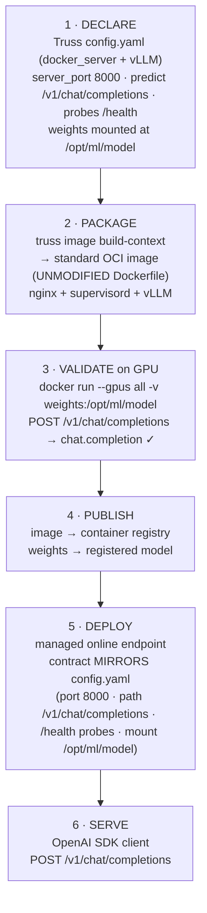

# Truss

**Truss** is a lightweight, open-source model-packaging framework (from Baseten;
[github.com/basetenlabs/truss](https://github.com/basetenlabs/truss)) that turns a declarative YAML
description of a model into a standard **OCI container** you can run anywhere. The key takeaway for
platform teams: **three of its four serving backends produce fully portable containers** that need nothing
from Baseten at runtime — only the **TensorRT-LLM / Briton** backend is coupled to Baseten's server-side
engine builder, and pushing to Baseten's hosted endpoint is an **optional** convenience.

---

## 1. What Truss is

Truss is an OSS model‑packaging framework that provides:

1. **A declarative language (YAML)** to specify the model, its dependencies (base runtime, Python/system
   packages, accelerators), and its runtime configuration — context/sequence length, tensor‑ and
   data‑parallelism, max concurrency, GPU memory fraction, etc. In short, *the parameters needed to boot
   the serving runtime.*
2. **Packaging of those dependencies into a container for serving.** The output is a standard OCI image
   that can run anywhere containers run (local Docker, Kubernetes, cloud managed endpoints).
3. **An optional integration to push the container to the Baseten platform** to obtain a managed live
   inference endpoint. This step is opt‑in and is not required to build or run the container elsewhere.

## 2. Core capabilities

| Capability | What it does |
|---|---|
| **Declarative `config.yaml`** | Single source of truth for model, dependencies, resources, and runtime tuning. |
| **`truss image build` / `build-context`** | Produces a standard OCI image (or a build context you can build yourself). Runs on any OCI builder/registry. |
| **Local serving** | Run and test the container locally before publishing. |
| **Declared serving contract** | The package declares its server **port** and its **predict / readiness / liveness** endpoints — the contract any host uses to route and health‑check the model. |
| **Optional `truss push`** | Convenience path to a managed, hosted endpoint on the Baseten platform. |

## 3. Serving backends — what, when, and portability

Truss supports four backends, selected by keys in `config.yaml`:

| # | Backend | `config.yaml` key | What it is | Baseten Service needed? | AzureML equivalent |
|---|---------|-------------------|------------|:---:|--------------------|
| 1 | [**TrussServer**](https://docs.baseten.co/development/model/model-class) (default) | `model/model.py` (+ `model_framework`, `requirements`) | Truss's own FastAPI/Uvicorn server running your `load()` / `predict()`. Framework-agnostic (transformers, PyTorch, sklearn, TF, custom Python). Use for custom/arbitrary Python models. | ✅ No | [**AzureML inference server**](https://learn.microsoft.com/en-us/azure/machine-learning/how-to-inference-server-http) — a `score.py` entry script with `init()` (load model) + `run()` (predict), run by `azmlinfsrv`; routes `GET /` (liveness), `POST /score`. Ships in the [prebuilt inference images](https://learn.microsoft.com/en-us/azure/machine-learning/concept-prebuilt-docker-images-inference). |
| 2 | [**docker_server**](https://docs.baseten.co/development/model/custom-server) | `docker_server:` | Wraps **any OpenAI-compatible HTTP server** (vLLM, TGI, Triton, SGLang, …) via image + start command + endpoints. Use for high-throughput LLM serving on a mature engine. | ✅ No | [**BYOC (custom container)**](https://learn.microsoft.com/en-us/azure/machine-learning/how-to-deploy-custom-container) + Deployment Template — declare `inference_config` (scoring / liveness / readiness routes). |
| 3 | [**base_image**](https://docs.baseten.co/development/model/dependencies) | `base_image:` | Bring-your-own base image for the TrussServer path (custom OS / CUDA / preinstalled deps). | ✅ No | [**BYOC**](https://learn.microsoft.com/en-us/azure/machine-learning/how-to-deploy-custom-container) + DT — a custom Environment image with `inference_config` (or the AzureML inference server layered on your base). |
| 4 | [**TRT_LLM (Briton)**](https://docs.baseten.co/engines/engine-builder-llm/overview) | `trt_llm:` | Baseten's **Briton** C++ TensorRT-LLM engine, built by a **server-side engine builder**. Use for max-performance TRT-LLM on Baseten. | ❌ Yes (needs Baseten's builder + Briton runtime) | [**BYOC**](https://learn.microsoft.com/en-us/azure/machine-learning/how-to-deploy-custom-container) + DT — but you must supply your **own** TensorRT-LLM / Triton container; Baseten's Briton builder itself does not port off-Baseten. |

**How the mapping works.** *TrussServer* and the **AzureML inference server** share the same two-method Python contract: Truss's `load()` / `predict()` in `model/model.py` map directly to AzureML's `init()` / `run()` in `score.py` (served by `azmlinfsrv` at `POST /score`, liveness `GET /`). The other three backends are **Bring-Your-Own-Container**: the package ships a container that serves its own HTTP, and AzureML routes to it via `inference_config` (scoring / liveness / readiness routes) — carried, in the PoC (§5), by a **Deployment Template**.

**Further reading:** [Truss configuration reference](https://docs.baseten.co/reference/truss-configuration) · [Custom Docker servers](https://docs.baseten.co/development/model/custom-server) · [Truss vLLM example](https://docs.baseten.co/examples/vllm) · [AzureML inference server](https://learn.microsoft.com/en-us/azure/machine-learning/how-to-inference-server-http) · [AzureML custom container (BYOC)](https://learn.microsoft.com/en-us/azure/machine-learning/how-to-deploy-custom-container).

## 4. Portability: what runs off‑Baseten vs what needs Baseten

**Runs on any container platform (Kubernetes, cloud managed online endpoints, etc.):**

- **TrussServer**, **docker_server**, and **base_image** all emit **standard, self‑contained OCI images.**
  The container declares its own serving contract (port + predict/readiness/liveness endpoints), so a host
  only needs to (a) run the image, (b) route requests to the declared port/path, and (c) health‑check the
  declared probe endpoints. Nothing Baseten‑specific is required at runtime.

**Requires the Baseten platform:**

- **TRT_LLM / Briton** depends on Baseten's **server‑side engine builder** and the proprietary **Briton**
  runtime, so it cannot be reproduced on a generic container platform.
- The **hosted endpoint** produced by `truss push` is a Baseten platform service. This is a *deployment
  convenience*, not a packaging requirement — the same container built by Truss can be published to any
  registry and run elsewhere.

> **Bottom line:** For LLM serving off‑Baseten, **`docker_server` (wrapping vLLM/TGI/Triton) and
> **TrussServer**/`base_image` are the portable, platform‑agnostic paths. `trt_llm` is the Baseten‑coupled
> path.

## 5. End‑to‑end PoC — `docker_server` + vLLM on a managed container platform

The accompanying notebook ([`build-test-promote.ipynb`](build-test-promote.ipynb)) is a self‑contained,
public‑domain demonstration that a **Truss `docker_server` + vLLM** package runs **unmodified** on a
standard managed online‑endpoint platform (the PoC target was AzureML managed online endpoints, a
Kubernetes‑based managed container service). It exercises the *portable* path end‑to‑end:

1. **Declare** — write a Truss `config.yaml` using the `docker_server` backend over `vllm/vllm-openai`,
   declaring `server_port: 8000`, `predict_endpoint: /v1/chat/completions`, and `/health` for
   readiness/liveness. Weights are **mounted at runtime** (`/opt/ml/model`), not baked into the image.
2. **Package** — `truss image build-context` emits a standard OCI image. **The generated Dockerfile is used
   unmodified** — the package descriptor (`config.yaml`) is the only thing that declares behavior.
3. **Validate on GPU** — run the exact image locally with the GPU, mount the weights, and confirm native
   `POST /v1/chat/completions` returns an OpenAI `chat.completion` **before** publishing.
4. **Publish** — push the validated image to a container registry and register the model (weights).
5. **Deploy** — stand up a managed online endpoint whose serving contract **mirrors the Truss declaration**
   (`scoring_port 8000`, scoring path `/v1/chat/completions`, `/health` probes, weights mounted at
   `/opt/ml/model`).
6. **Serve** — call the live endpoint with the standard **OpenAI SDK** and get a chat completion.

### Block diagram

### Why this matters

The PoC shows the **portability property** of Truss's `docker_server` backend in practice: a model packaged
once, as a standard container that **declares its own serving contract**, is consumed by a generic managed
container platform with a **mechanical mapping** — the platform's port, path, health probes, and weight
mount are set directly from what the Truss package declares. No Baseten runtime is involved.

## 6. Takeaways

- **Truss is fundamentally a packaging tool**: declarative config → portable OCI container with a declared
  serving contract.
- **Three of four backends (TrussServer, docker_server, base_image) are platform‑agnostic** and run on any
  container host (Kubernetes, cloud managed endpoints).
- **Only `trt_llm` (Briton) requires the Baseten platform**; the hosted `truss push` endpoint is optional.
- For **portable LLM serving**, `docker_server` over vLLM/TGI/Triton is the recommended path — demonstrated
  end‑to‑end in the accompanying notebook, including native OpenAI `/v1/chat/completions`.
