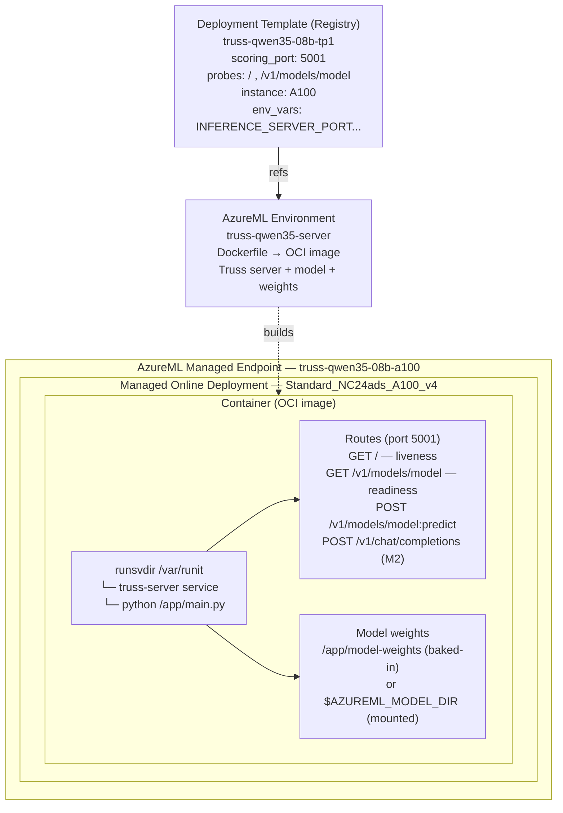

# Truss on AzureML Online Endpoint — Proof of Concept

Validates whether a **Truss-packaged model** can run on an **Azure Machine Learning managed online endpoint** through a **Foundry/AML deployment template**.

## Architecture



## Prerequisites

- Azure CLI with `ml` extension (`az extension add -n ml`)
- Python 3.11+ with `truss` package (`pip install truss`)
- Access to an AzureML workspace and registry (set `AZUREML_WORKSPACE` / `AZUREML_REGISTRY`)
- Model weights at `../azureml-deployment-templates/models/qwen--qwen3-5-0-8b/model-artifacts/`

## Quick Start

```bash
# From repo root
cd truss-poc/scripts

# Run full pipeline (validate → build → deploy → test)
bash run-all.sh

# Or run steps individually:
bash 0-validate.sh
bash 1-create-environment.sh    # ~15-20 min (remote Docker build)
bash 2-register-model.sh
bash 3-create-deployment-template.sh
bash 4-create-endpoint.sh
bash 5-create-deployment.sh     # ~15-30 min (GPU provisioning)
bash 6-route-traffic.sh
bash 7-test-inference.sh
bash 8-verify-health.sh
```

## Directory Structure

```
truss-poc/
├── README.md                 ← This file
├── truss-model/              ← Truss model project
│   ├── config.yaml           ← Truss configuration
│   └── model/
│       ├── __init__.py
│       └── model.py          ← Model class (load + predict)
├── docker/                   ← AzureML environment build context
│   ├── Dockerfile            ← Container image definition
│   └── runit-truss.sh        ← runit service script
├── yaml/                     ← AzureML resource definitions
│   ├── environment.yml       ← Environment (triggers image build)
│   ├── model.yml             ← Model registration
│   ├── deployment-template.yml ← Deployment template
│   ├── endpoint.yml          ← Online endpoint
│   └── deployment.yml        ← Online deployment (derived from DT)
├── scripts/                  ← Automation scripts
│   ├── env.sh                ← Shared variables and helpers
│   ├── 0-validate.sh         ← Prerequisites check
│   ├── 1-create-environment.sh
│   ├── 2-register-model.sh
│   ├── 3-create-deployment-template.sh
│   ├── 4-create-endpoint.sh
│   ├── 5-create-deployment.sh
│   ├── 6-route-traffic.sh
│   ├── 7-test-inference.sh
│   ├── 8-verify-health.sh
│   └── run-all.sh            ← Full pipeline runner
├── logs/                     ← Timestamped execution logs
│   └── YYYY-MM-DD_HH-MM-SS/
└── docs/
    ├── summary.md            ← Executive summary
    └── detailed-findings.md  ← Full evaluation
```

## Deployment Template ↔ Deployment YAML Mapping

| Deployment Template Field | Deployment YAML Field | Notes |
|---|---|---|
| `environment` | `environment` | Direct reference |
| `default_instance_type` | `instance_type` | DT provides options; deployment picks one |
| `instance_count` | `instance_count` | Direct |
| `scoring_port` | _(not in deployment YAML)_ | Applied by AzureML from DT |
| `scoring_path` | _(not in deployment YAML)_ | Applied by AzureML from DT |
| `model_mount_path` | _(NOT set in deployment)_ | In DT only; causes error in deployment |
| `environment_variables` | `environment_variables` | Direct copy |
| `request_settings` | `request_settings` | Direct copy |
| `liveness_probe` | `liveness_probe` | Port/path from DT, basic fields in deployment |
| `readiness_probe` | `readiness_probe` | Port/path from DT, basic fields in deployment |

## Truss Server Endpoints (Port 8080)

| Method | Path | Purpose |
|---|---|---|
| `GET` | `/` | Liveness (returns `true` when server is up) |
| `GET` | `/v1/models/{name}` | Readiness (returns model status) |
| `POST` | `/v1/models/{name}:predict` | Truss native prediction |
| `POST` | `/v1/chat/completions` | OpenAI-compatible chat |
| `POST` | `/v1/completions` | OpenAI-compatible completions |
| `GET` | `/ping` | SageMaker-compatible health |

## Key Differences from vLLM Deployment

| Aspect | vLLM | Truss |
|---|---|---|
| Port | 8000 | 8080 |
| Health path | `/health` | `/` |
| Predict path | `/v1/chat/completions` | `/v1/models/model:predict` |
| Server | vLLM OpenAI server | Truss FastAPI server |
| GPU utilization | Configurable (VLLM_GPU_MEMORY_UTILIZATION) | PyTorch default |
| Batching | Continuous (vLLM PagedAttention) | None (single request) |
| Streaming | Yes | Yes (if model returns generator) |

## Environment Variables

| Variable | Value | Purpose |
|---|---|---|
| `INFERENCE_SERVER_PORT` | `8080` | Truss server listen port |
| `MODEL_WEIGHTS_PATH` | `/app/model-weights` | Where model.py looks for weights |
| `HF_HUB_OFFLINE` | `1` | Prevent HuggingFace Hub downloads |
| `TRANSFORMERS_OFFLINE` | `1` | Prevent transformers downloads |
| `PYTHONUNBUFFERED` | `1` | Real-time log output |
| `AZUREML_MODEL_DIR` | _(set by AzureML)_ | Overrides MODEL_WEIGHTS_PATH when mounted |
