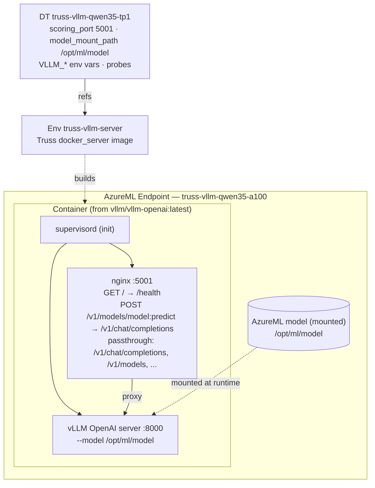

# Truss + vLLM on AzureML — Sample (Milestone 2, `docker_server` backend)

Runs Qwen/Qwen3.5-0.8B on an AzureML managed online endpoint using **Truss's
`docker_server` backend** wrapping the **official vLLM image** the repo already
uses (`vllm/vllm-openai:latest`) — deployed through the same
deployment-template-inheritance flow as the transformers sample.

Two things this sample demonstrates that the transformers sample does not:
1. **vLLM serves `/v1/chat/completions`** natively — reached on AzureML via the
   Truss predict path `/v1/models/model:predict` (AzureML's router only forwards
   KServe-style paths; see `docs/findings.md` §7). The response is a standard
   OpenAI `chat.completion`.
2. **Weights are mounted at runtime** from the AzureML model (`model_mount_path`),
   **not baked** into the image.

## Backend: Truss `docker_server`

`truss-model/config.yaml` selects the backend. Truss generates a container with
**nginx + supervisord** fronting vLLM (see `docker/README.md`). This is *not* the
Baseten-coupled `trt_llm`/Briton backend (that one requires Baseten's server-side
engine builder — see `docs/` for why native Truss-TRT-LLM is not viable here).

## Architecture



## Run

```bash
cd truss-poc/vllm/scripts
bash run-all.sh
# or step-by-step: 0-validate → 1-create-environment → 2b-register-model-manifest
#   → 3-create-deployment-template → 3b-tag-model-dt → 4-create-endpoint
#   → 5-create-deployment → 6-route-traffic → 7-test-inference → 8-verify-health
```

## Resource names (distinct from the transformers sample)

| Asset | transformers | vllm |
|---|---|---|
| Environment | `truss-qwen35-server` | `truss-vllm-server` |
| Model | `truss-qwen35-08b` (baked-in) | `truss-vllm-qwen35` (mounted) |
| Deployment template | `truss-qwen35-08b-tp1` | `truss-vllm-qwen35-tp1` |
| Endpoint | `truss-qwen35-08b-a100` | `truss-vllm-qwen35-a100` |
| Deployment | `truss-qwen35-vllm` | `truss-vllm-dep` |
